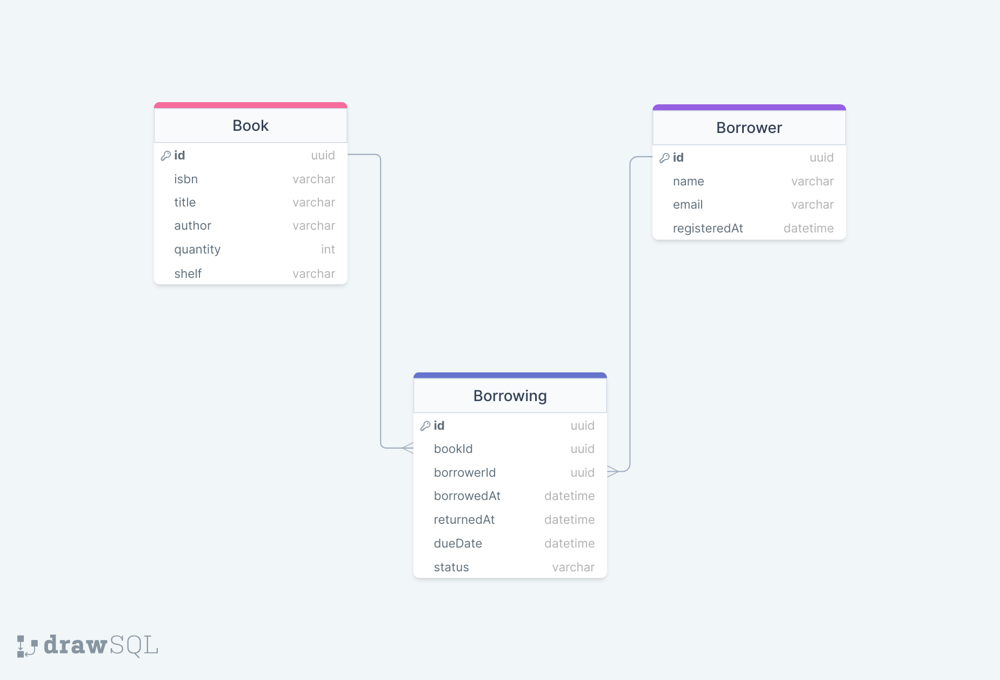

# Library Management System

## Project Overview

The Library Management System is designed to manage books and borrowers efficiently. It allows for adding, updating, and deleting books and borrowers. The system also supports checking out and returning books while keeping track of due dates and overdue books. 

This project is implemented using Node.js and uses a relational database MySQL to store data. It features a RESTful API for interacting with the system.

## Getting Started

### Prerequisites

- Node.js
- npm
- A relational database MySQL

### Installation

##  Clone the repository:
```sh
   git clone https://github.com/YahiaAshraf74/Library-Mangemet-System.git
```

## Install NPM packages:
```
    install npm
```
## Configure your database connection by creating a .env file
```
    DATABASE_NAME=your_database_name
    DATABASE_USER=your_database_user
    DATABASE_PASSWORD=your_database_password
    DATABASE_HOST=your_database_host
```

##  Database Setup

Before running the application, set up the MySQL database using the following commands.

#### Create Database

```sql
CREATE DATABASE library_management;
``` 

#### Create Tables
```
USE library_management;

CREATE TABLE books (
    id CHAR(36) NOT NULL,
    isbn VARCHAR(13) NOT NULL UNIQUE,
    title VARCHAR(255) NOT NULL,
    author VARCHAR(255) NOT NULL,
    quantity INT NOT NULL,
    shelf VARCHAR(100) NOT NULL,
    PRIMARY KEY (id)
);

CREATE TABLE borrowers (
    id CHAR(36) NOT NULL,
    name VARCHAR(255) NOT NULL,
    email VARCHAR(255) NOT NULL UNIQUE,
    registeredAt DATETIME NOT NULL DEFAULT CURRENT_TIMESTAMP,
    PRIMARY KEY (id)
);

CREATE TABLE borrowings (
    id CHAR(36) NOT NULL,
    bookId CHAR(36) NOT NULL,
    borrowerId CHAR(36) NOT NULL,
    borrowedAt DATETIME NOT NULL DEFAULT CURRENT_TIMESTAMP,
    returnedAt DATETIME,
    dueDate DATETIME NOT NULL,
    status VARCHAR(50) NOT NULL DEFAULT 'checked out',
    PRIMARY KEY (id),
    FOREIGN KEY (bookId) REFERENCES books(id) ON DELETE CASCADE ON UPDATE CASCADE,
    FOREIGN KEY (borrowerId) REFERENCES borrowers(id) ON DELETE CASCADE ON UPDATE CASCADE
);
```

#### Seed Initial Data (Optional)
```
-- Add some initial books
INSERT INTO books (id, isbn, title, author, quantity, shelf) VALUES
(UUID(), '978-3-16-148410-0', 'Sample Book 1', 'Author Name', 5, 'Shelf A'),
(UUID(), '978-1-23-456789-7', 'Sample Book 2', 'Another Author', 3, 'Shelf B');

-- Add some borrowers
INSERT INTO borrowers (id, name, email) VALUES
(UUID(), 'John Doe', 'john.doe@example.com'),
(UUID(), 'Jane Smith', 'jane.smith@example.com');

-- Add a borrowing record
INSERT INTO borrowings (id, bookId, borrowerId, dueDate) VALUES
(UUID(), (SELECT id FROM books WHERE isbn = '978-3-16-148410-0'), (SELECT id FROM borrowers WHERE email = 'john.doe@example.com'), DATE_ADD(NOW(), INTERVAL 14 DAY));
```



---

## API Endpoints

### Books

1. **Create a New Book**
    - **Method**: `POST`
    - **Endpoint**: `/api/books`
    - **Body**:
        ```json
        {
            "isbn": "11234567890",
            "title": "Example Book",
            "author": "Ahmed Yahia",
            "quantity": 5,
            "shelf": "A9"
        }
        ```
    - **Response**: A JSON object representing the created book.

2. **Update Book Details**
    - **Method**: `PUT`
    - **Endpoint**: `/api/books/{bookId}`
    - **Body**:
        ```json
        {
            "title": "Updated Title",
            "author": "Ali Ashraf",
            "quantity": 5,
            "shelf": "A1"
        }
        ```
    - **Response**: A JSON object with a message indicating successful update.

3. **Delete a Book**
    - **Method**: `DELETE`
    - **Endpoint**: `/api/books/{bookId}`
    - **Response**: A JSON object with a message indicating successful deletion.

4. **List All Books**
    - **Method**: `GET`
    - **Endpoint**: `/api/books`
    - **Response**: An array of book objects.

5. **Search for a Book**
    - **Method**: `GET`
    - **Endpoint**: `/api/books/search?query={searchTerm}`
    - **Response**: An array of book objects that match the search term.

### Borrowers

1. **Register a New Borrower**
    - **Method**: `POST`
    - **Endpoint**: `/api/borrowers`
    - **Body**:
        ```json
        {
            "name": "Sara Khaled",
            "email": "sara.khaled@example.com"
        }
        ```
    - **Response**: A JSON object representing the created borrower.

2. **Update Borrower Details**
    - **Method**: `PUT`
    - **Endpoint**: `/api/borrowers/{borrowerId}`
    - **Body**:
        ```json
        {
            "name": "Alice Johnson",
            "email": "alice.johnson@example.com"
        }
        ```
    - **Response**: A JSON object with a message indicating successful update.

3. **Delete a Borrower**
    - **Method**: `DELETE`
    - **Endpoint**: `/api/borrowers/{borrowerId}`
    - **Response**: A JSON object with a message indicating successful deletion.

4. **List All Borrowers**
    - **Method**: `GET`
    - **Endpoint**: `/api/borrowers`
    - **Response**: An array of borrower objects.

### Borrowing

1. **Check Out a Book**
    - **Method**: `POST`
    - **Endpoint**: `/api/borrowing/check-out`
    - **Body**:
        ```json
        {
            "bookId": "fbedae60-435c-4d8d-9dde-2c650ab94685",
            "borrowerId": "87ef019e-43fa-4a97-82ed-bed184756dd4",
            "dueDate": "2024-04-30T10:00:00.000Z"
        }
        ```
    - **Response**: A JSON object representing the borrowing transaction.

2. **Return a Book**
    - **Method**: `POST`
    - **Endpoint**: `/api/borrowing/return/{borrowingId}`
    - **Response**: A JSON object with a message indicating successful return.

3. **List Borrowed Books for a Borrower**
    - **Method**: `GET`
    - **Endpoint**: `/api/borrowing/borrowed-books/{clientId}`
    - **Response**: An array of borrowing objects for the specified borrower.